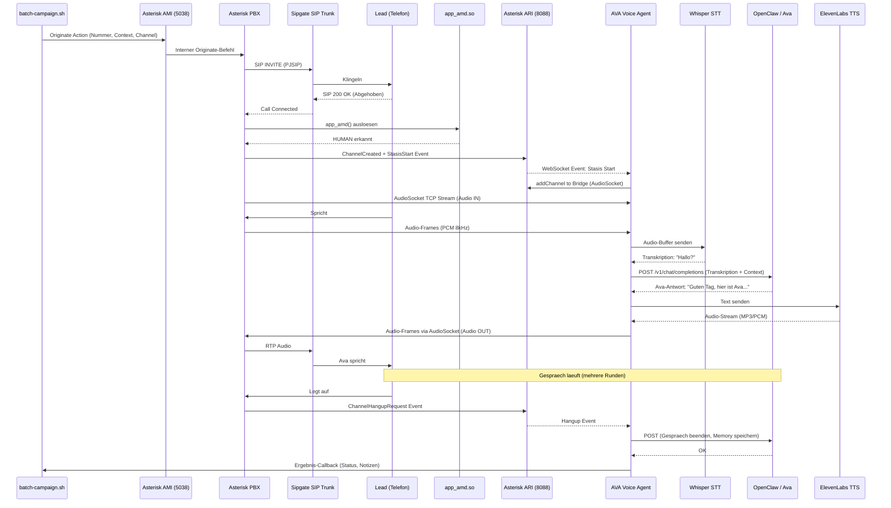
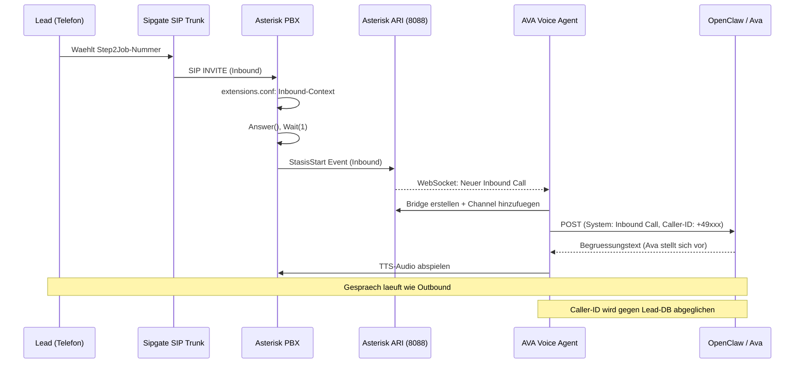
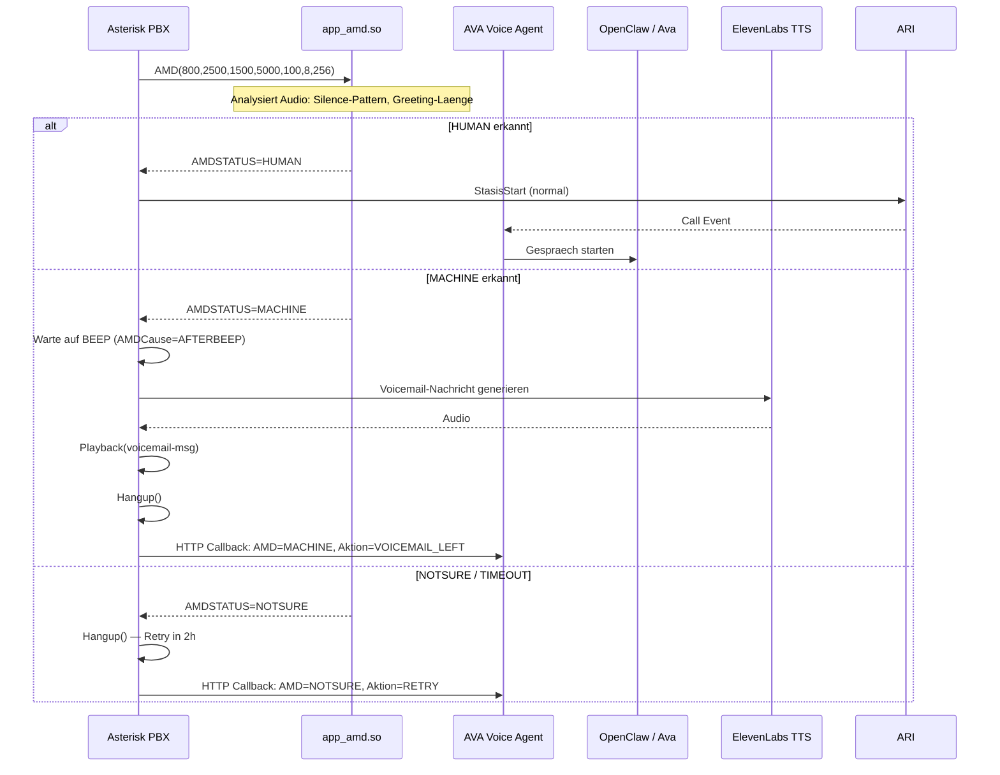
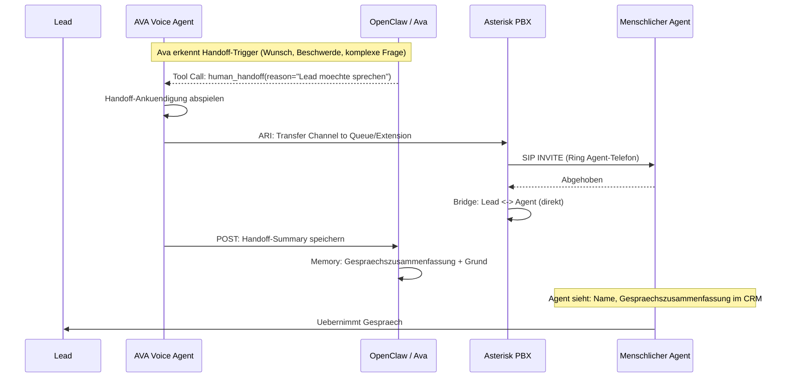
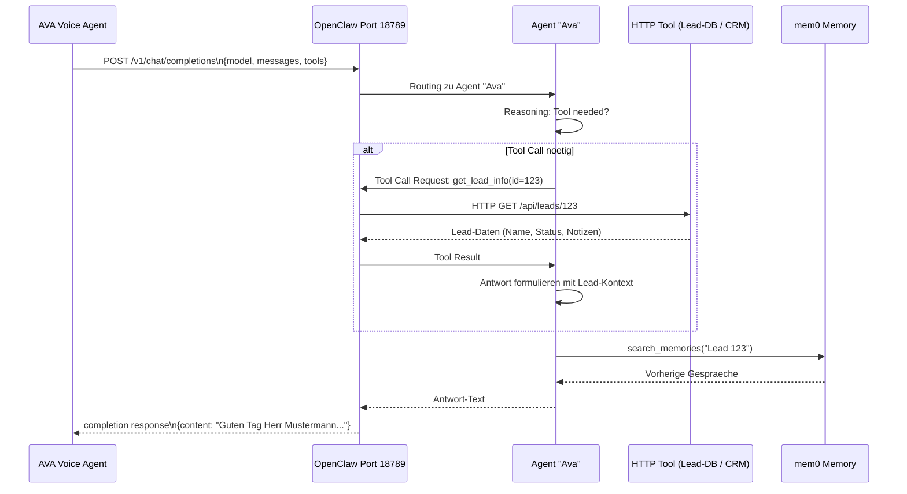

# Architektur — AVA + Asterisk + OpenClaw

## ASCII-Gesamtarchitektur

```
┌─────────────────────────────────────────────────────────────────────────┐
│                        STEP2JOB CALLCENTER STACK                        │
│                                                                         │
│  ┌──────────────┐    SIP/RTP    ┌─────────────────────────────────────┐ │
│  │   Sipgate    │◄─────────────►│          Asterisk PBX               │ │
│  │  SIP Trunk   │               │  ┌──────────────────────────────┐   │ │
│  │  (Flatrate)  │               │  │  chan_pjsip (SIP)             │   │ │
│  └──────────────┘               │  │  app_amd.so (AMD)             │   │ │
│                                 │  │  MixMonitor (Recording)       │   │ │
│                                 │  │  app_audiosocket.so           │   │ │
│                                 │  │  ARI (HTTP:8088)              │   │ │
│                                 │  │  AMI (TCP:5038)               │   │ │
│                                 │  └──────────┬───────────────────┘   │ │
│                                 └─────────────┼───────────────────────┘ │
│                                               │ ARI WebSocket           │
│                                               │ AudioSocket TCP:9092    │
│                                 ┌─────────────▼───────────────────────┐ │
│                                 │       AVA AI Voice Agent             │ │
│                                 │       (Python, Port 8080)            │ │
│                                 │  ┌────────────┐ ┌────────────────┐  │ │
│                                 │  │  STT       │ │  TTS           │  │ │
│                                 │  │  Whisper   │ │  ElevenLabs    │  │ │
│                                 │  │  (lokal)   │ │  Azure TTS     │  │ │
│                                 │  │  oder      │ │  (konfigurb.)  │  │ │
│                                 │  │  Deepgram  │ └────────────────┘  │ │
│                                 │  └────────────┘                     │ │
│                                 │         │ HTTP POST                 │ │
│                                 └─────────┼───────────────────────────┘ │
│                                           │                             │
│                                 ┌─────────▼───────────────────────────┐ │
│                                 │         OpenClaw API                 │ │
│                                 │         Port 18789                   │ │
│                                 │    ┌─────────────────────┐          │ │
│                                 │    │  Agent "Ava"         │          │ │
│                                 │    │  claude-sonnet-4-6   │          │ │
│                                 │    │  Skills + Memory     │          │ │
│                                 │    └──────────┬──────────┘          │ │
│                                 └──────────────┼────────────────────── │ │
│                                               │                        │
│                                  ┌────────────▼──────────────────────┐ │
│                                  │       Memory Layer                  │ │
│                                  │  mem0 (Port 8002) + Supermemory    │ │
│                                  └────────────────────────────────────┘ │
└─────────────────────────────────────────────────────────────────────────┘
```

## Mermaid: Outbound Call Flow



## Mermaid: Inbound Call Flow



## Mermaid: AMD / Voicemail Detection Flow



## Mermaid: Human Handoff Flow



## Mermaid: OpenClaw HTTP Tool Call Flow



## Komponentenliste

| Komponente | Version | Port | Rolle | Laeuft auf |
|---|---|---|---|---|
| Asterisk PBX | 20.x | 5060 (SIP), 10000-20000 (RTP) | SIP-Gateway, AMD, Recording, Routing | Lokal / Server |
| Asterisk ARI | 20.x | 8088 (HTTP/WS) | Programmatic Call Control | Lokal / Server |
| Asterisk AMI | 20.x | 5038 (TCP) | Call Origination via Script | Lokal / Server |
| Sipgate SIP Trunk | - | - | Externer SIP-Carrier (PSTN) | Sipgate-Cloud |
| AVA AI Voice Agent | latest | 8080 (HTTP intern) | STT/TTS-Bridge, ARI-Client | Lokal / Server |
| Whisper STT | large-v3 | lokal (keine) | Speech-to-Text | Lokal / Server |
| Deepgram STT | API | - | Speech-to-Text (Alternative) | Deepgram-Cloud |
| ElevenLabs TTS | API | - | Text-to-Speech (HQ) | ElevenLabs-Cloud |
| Azure Cognitive TTS | API | - | Text-to-Speech (Alternative) | Azure-Cloud |
| OpenClaw | latest | 18789 | LLM-Router + Agent-Runtime | Lokal (Mac) |
| Agent "Ava" | claude-sonnet-4-6 | via OpenClaw | Conversational AI | via OpenClaw |
| mem0 | latest | 8002 | Memory-Persistence | CCT Server |

## Netzwerk-Diagramm: Offene Ports

```
EINGEHEND (Firewall freigeben):
  UDP 5060       — SIP Signaling (Sipgate → Asterisk)
  UDP 10000-20000 — RTP Media (Sipgate → Asterisk)
  TCP 8088       — ARI HTTP/WebSocket (AVA → Asterisk) [nur lokal/LAN]
  TCP 5038       — AMI (Scripts → Asterisk) [nur lokal/LAN]
  TCP 9092       — AudioSocket (Asterisk → AVA) [nur lokal/LAN]

AUSGEHEND (keine spezielle Freigabe noetig):
  TCP 443        — ElevenLabs TTS API
  TCP 443        — Deepgram STT API
  TCP 443        — Sipgate API
  TCP 18789      — OpenClaw API (lokal)
  TCP 8002       — mem0 API (via SSH-Tunnel)

INTERNE KOMMUNIKATION (lokal, kein Internet):
  AVA → Asterisk ARI:       HTTP/WS auf 127.0.0.1:8088
  AVA → Asterisk AudioSocket: TCP auf 127.0.0.1:9092
  AVA → OpenClaw:           HTTP auf 127.0.0.1:18789
  Scripts → Asterisk AMI:   TCP auf 127.0.0.1:5038
```
