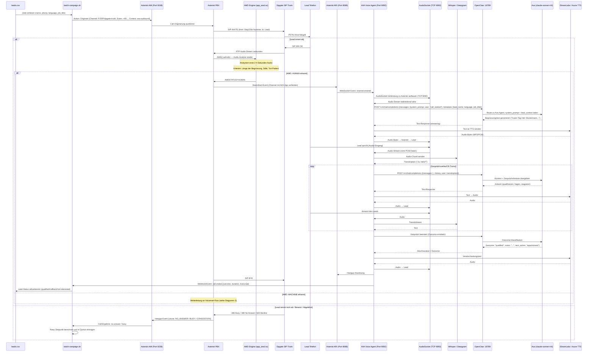
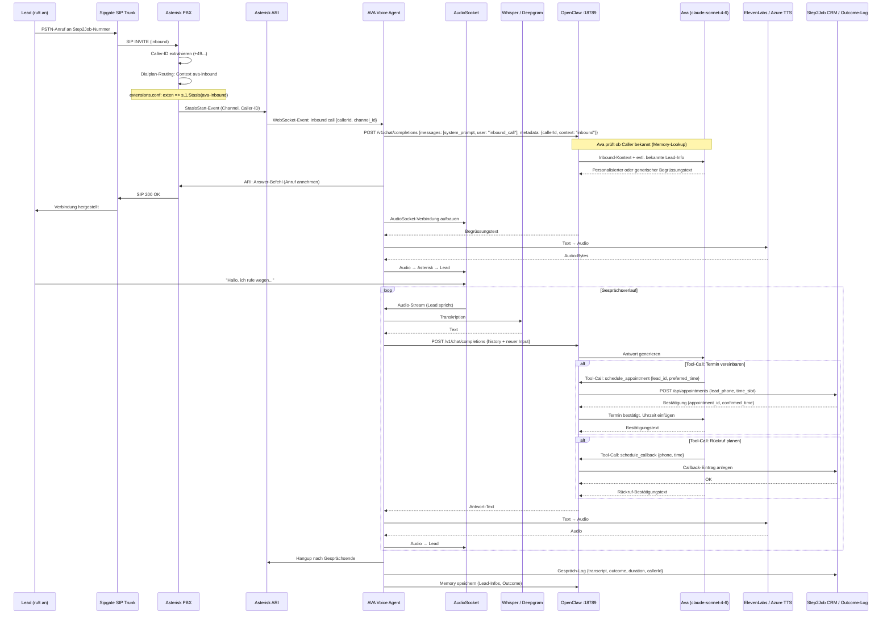
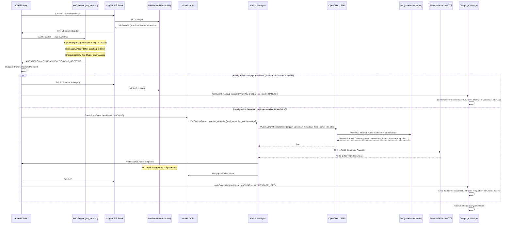
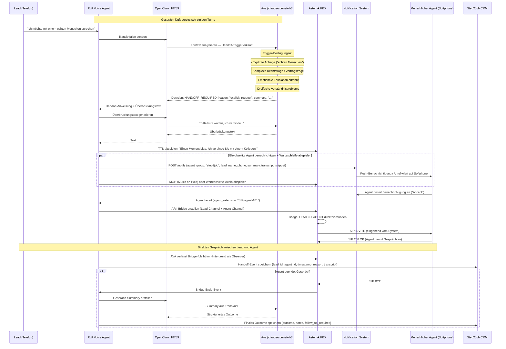
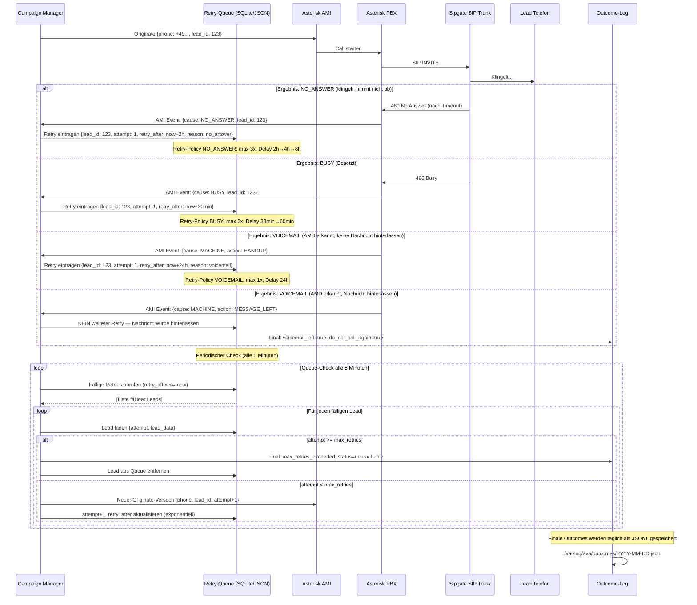
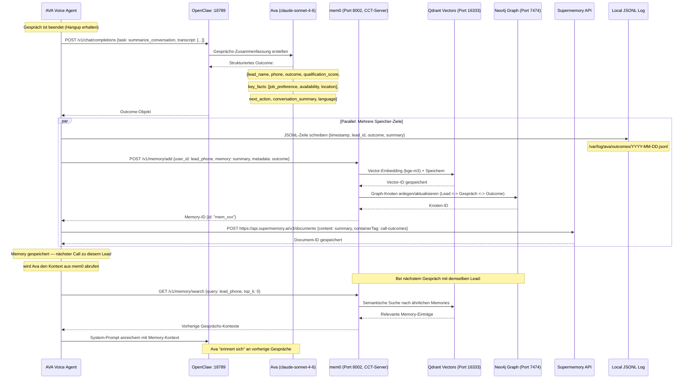
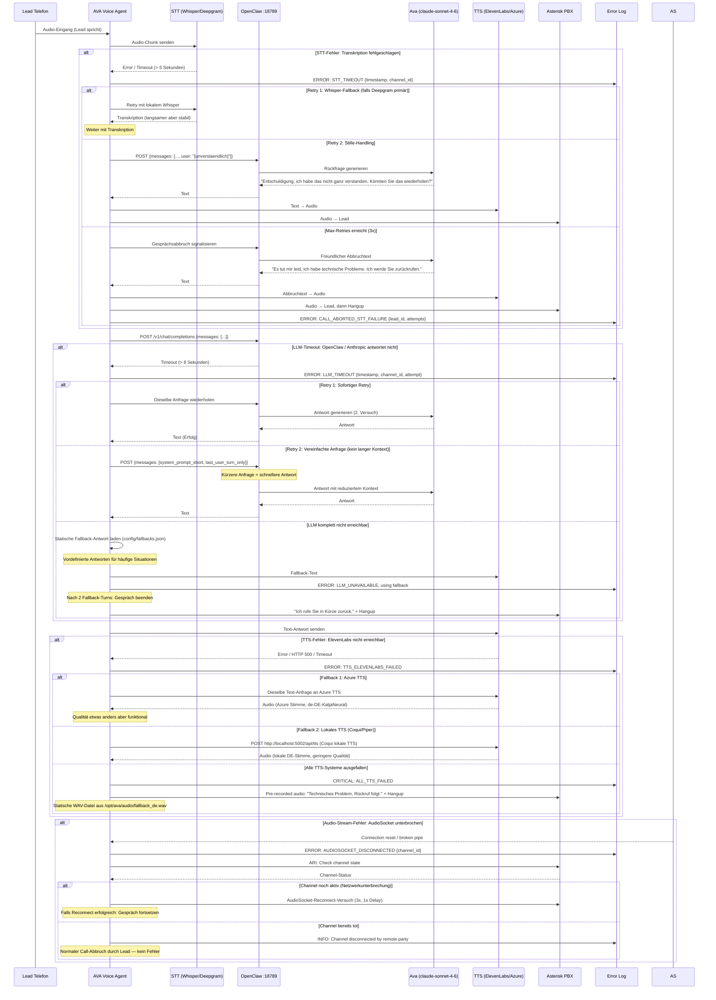

# Workflows — AVA + Asterisk + OpenClaw AI-Callcenter
## Detaillierte Sequenzdiagramme aller Gesprächsabläufe

---

## 1. Outbound Lead-Calling (Komplettfluss)

Vom Kampagnen-Start über Asterisk-AMD bis zum abgeschlossenen Gespräch mit Ava.

---

## 2. Inbound Call Flow

Ein Lead ruft auf der Step2Job-Nummer an — Ava antwortet automatisch.

---

## 3. AMD: Voicemail erkannt

Was passiert wenn der Anrufbeantworter des Leads antwortet.

---

## 4. Human Handoff

Ava erkennt, dass ein Fall menschliche Expertise erfordert und übergibt an einen echten Mitarbeiter.

---

## 5. Retry-Logik

Kein Abnehmer, besetzt oder kein Durchkommen — wann und wie wird erneut angerufen.

---

## 6. Memory-Flow

Was OpenClaw / Ava nach einem Gespräch speichert und wo.

---

## 7. Error-Flow

STT-Fehler, LLM-Timeout, TTS-Fehler — Fallbacks und Fehlerbehandlung.

